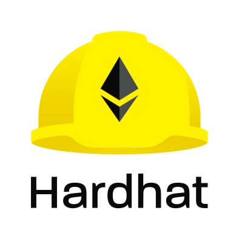

# 

[](https://docs.openzeppelin.com/upgrades-plugins)
[](https://codecov.io/gh/OpenZeppelin/openzeppelin-upgrades)

**Integrate upgrades into your existing workflow.** Plugins for [Hardhat](https://hardhat.org/) and [Truffle](https://www.trufflesuite.com/truffle) to deploy and manage upgradeable contracts on Ethereum.

- Deploy upgradeable contracts.
- Upgrade deployed contracts.
- Manage proxy admin rights.
- Easily use in tests.

## Installation

### Hardhat

```
npm install --save-dev @openzeppelin/hardhat-upgrades
npm install --save-dev @nomiclabs/hardhat-ethers ethers # peer dependencies
```

```js
// hardhat.config.js
require('@openzeppelin/hardhat-upgrades');
```

### Truffle

```
npm install --save-dev @openzeppelin/truffle-upgrades
```

## Usage

See the documentation for each plugin, or take a look at the sample code snippets below.

| [Hardhat](./packages/plugin-hardhat/README.md)| [Truffle](./packages/plugin-truffle/README.md) |
|-|-|

Hardhat users will be able to write [scripts](https://hardhat.org/guides/scripts.html) that use the plugin to deploy or upgrade a contract, and manage proxy admin rights.

```js
const { ethers, upgrades } = require("hardhat");

async function main() {
  // Deploying
  const Box = await ethers.getContractFactory("Box");
  const instance = await upgrades.deployProxy(Box, [42]);
  await instance.deployed();

  // Upgrading
  const BoxV2 = await ethers.getContractFactory("BoxV2");
  const upgraded = await upgrades.upgradeProxy(instance.address, BoxV2);
}

main();
```

Truffle users will be able to write [migrations](https://www.trufflesuite.com/docs/truffle/getting-started/running-migrations) that use the plugin to deploy or upgrade a contract, or manage proxy admin rights.

```js
const { deployProxy, upgradeProxy } = require('@openzeppelin/truffle-upgrades');

const Box = artifacts.require('Box');
const BoxV2 = artifacts.require('BoxV2');

module.exports = async function (deployer) {
  const instance = await deployProxy(Box, [42], { deployer });
  const upgraded = await upgradeProxy(instance.address, BoxV2, { deployer });
}
```

Whether you're using Hardhat or Truffle, you can use the plugin in your tests to ensure everything works as expected.

```js
it('works before and after upgrading', async function () {
  const instance = await upgrades.deployProxy(Box, [42]);
  assert.strictEqual(await instance.retrieve(), 42);
  
  await upgrades.upgradeProxy(instance.address, BoxV2);
  assert.strictEqual(await instance.retrieve(), 42);
});
```

## How do the plugins work?

Both plugins provide two main functions, `deployProxy` and `upgradeProxy`, which take care of managing upgradeable deployments of your contracts. In the case of `deployProxy`, this means:

1. Validate that the implementation is [upgrade safe](https://docs.openzeppelin.com/upgrades-plugins/faq#what-does-it-mean-for-a-contract-to-be-upgrade-safe)

2. Deploy a [proxy admin](https://docs.openzeppelin.com/upgrades-plugins/faq#what-is-a-proxy-admin) for your project

3. Check if there is an [implementation contract](https://docs.openzeppelin.com/upgrades-plugins/faq#what-is-an-implementation-contract) deployed with the same bytecode, and deploy one if not

4. Create and initialize the proxy contract

And when you call `upgradeProxy`:

1. Validate that the new implementation is [upgrade safe](https://docs.openzeppelin.com/upgrades-plugins/faq#what-does-it-mean-for-a-contract-to-be-upgrade-safe) and is [compatible](https://docs.openzeppelin.com/upgrades-plugins/faq#what-does-it-mean-for-an-implementation-to-be-compatible) with the previous one

2. Check if there is an [implementation contract](https://docs.openzeppelin.com/upgrades-plugins/faq#what-is-an-implementation-contract) deployed with the same bytecode, and deploy one if not

3. Upgrade the proxy to use the new implementation contract

The plugins will keep track of all the implementation contracts you have deployed in an `.openzeppelin` folder in the project root, as well as the proxy admin. You will find one file per network there. It is advised that you commit to source control the files for all networks except the development ones (you may see them as `.openzeppelin/unknown-*.json`).

> Note: the format of the files within the `.openzeppelin` folder is not compatible with those of the [OpenZeppelin CLI](https://docs.openzeppelin.com/cli). If you want to use these plugins for an existing OpenZeppelin CLI project, we will be sharing soon a guide on how to migrate.

## Managing ownership

All proxies define an _admin_ address which has the rights to upgrade them. By default, the admin is a [proxy admin contract](https://docs.openzeppelin.com/upgrades-plugins/faq#what-is-a-proxy-admin) deployed behind the scenes. You can change the admin of a proxy by calling the `admin.changeAdminForProxy` function in the plugin. Keep in mind that the _admin_ of a proxy can only upgrade it, but not interact with the implementation contract. Read [here](https://docs.openzeppelin.com/upgrades-plugins/proxies#transparent-proxies-and-function-clashes) for more info on this restriction.

The proxy admin contract also defines an _owner_ address which has the rights to operate it. By default, this address is the externally owned account used during deployment. You can change the proxy admin owner by calling the `admin.transferProxyAdminOwnership` function in the plugin. Note that changing the proxy admin owner effectively transfers the power to upgrade any proxy in your whole project to the new owner, so use with care.

Once you have transferred the rights to upgrade a proxy to another address, you can still use your local setup to validate and deploy the implementation contract. The plugins include a `prepareUpgrade` function that will validate that the new implementation is upgrade-safe and compatible with the previous one, and deploy it using your local Ethereum account. You can then execute the upgrade itself from the admin address. You can also use the `proposeUpgrade` function to automatically set up the upgrade in [Defender Admin](https://docs.openzeppelin.com/defender/admin).

Refer to each plugin documentation for more details on the `admin` functions.

## Community

Join the [OpenZeppelin forum](https://forum.openzeppelin.com/) to ask questions or discuss about these plugins, smart contracts upgrades, or anything related to Ethereum development!

## License

OpenZeppelin Upgrade plugins are released under the [MIT License](LICENSE).
