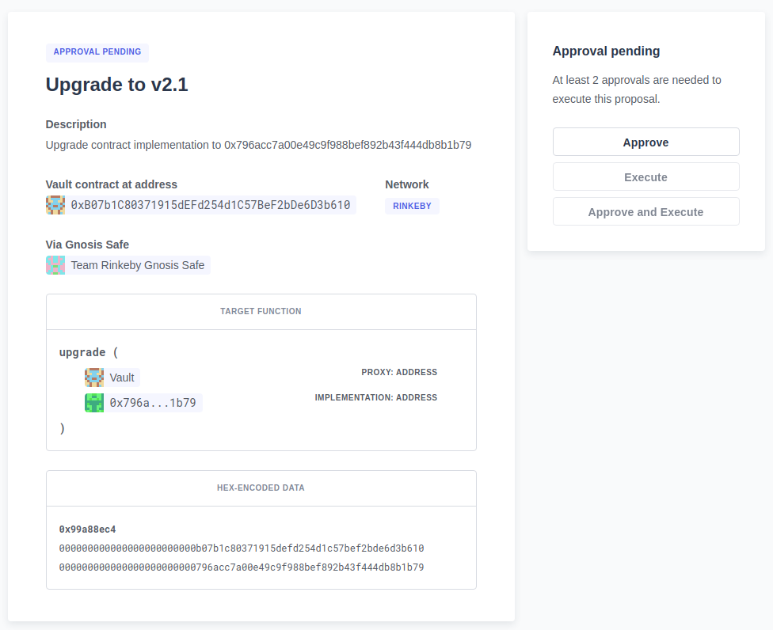

# OpenZeppelin Hardhat Defender Upgrades

[](https://docs.openzeppelin.com/upgrades-plugins/hardhat-upgrades)
[](https://www.npmjs.org/package/@openzeppelin/hardhat-defender)

**Hardhat plugin for integrating upgrades with OpenZeppelin Defender.** This package adds functions to your Hardhat scripts so you can propose upgrades for your contracts and approve them via [Defender Admin](https://docs.openzeppelin.com/defender/admin). Depends on `@openzeppelin/hardhat-upgrades` and `ethers.js`.

## Why?

Use this package to manage upgrades for mainnet contracts using Hardhat scripts, and then approve them by a multisig through Defender Admin. 

You can use `@openzeppelin/hardhat-upgrades` to deploy your upgradeable contracts via [`deployProxy`](https://docs.openzeppelin.com/upgrades-plugins/1.x/api-hardhat-upgrades#deploy-proxy), and then transfer the admin powers to a multi-signature wallet via [`transferProxyAdminOwnership`](https://docs.openzeppelin.com/upgrades-plugins/1.x/api-hardhat-upgrades#admin-transfer-proxy-admin-ownership) for additional security. 

When you want to upgrade, use `proposeUpgrade` to prepare the upgrade, and create a new upgrade proposal in Defender Admin. The multisig admins can then [review the upgrade in Defender](https://docs.openzeppelin.com/defender/admin#upgrades), and sign their approval.



## Installation

```
npm install --save-dev @openzeppelin/hardhat-defender
npm install --save-dev @nomiclabs/hardhat-ethers ethers # peer dependencies
```

Register the plugin in your [`hardhat.config.js`](https://hardhat.org/config/):

```js
// Javascript
require('@openzeppelin/hardhat-defender');

// Typescript
import '@openzeppelin/hardhat-defender';
```

And add your Defender _Team API key_ to the exported configuration in [`hardhat.config.js`](https://hardhat.org/config/):

```js
module.exports = {
  defender: {
    apiKey: process.env.API_KEY,
    apiSecret: process.env.API_SECRET,
  }
}
```

## Usage in scripts

You can use this plugin in a [Hardhat script](https://hardhat.org/guides/scripts.html) to propose an upgrade for a contract previously deployed with [`deployProxy`](https://docs.openzeppelin.com/upgrades-plugins/1.x/api-hardhat-upgrades#deploy-proxy):

```js
// scripts/propose-upgrade.js
const { defender } = require("hardhat");

async function main() {
  const BoxV2 = await ethers.getContractFactory("BoxV2");
  const proposal = await defender.proposeUpgrade(BOX_ADDRESS, BoxV2);
  console.log("Upgrade proposal created at:", proposal.url);
}

main();
```

This will automatically check that the `Box` contract deployed at `BOX_ADDRESS` can be safely upgraded to `BoxV2`, deploy the `BoxV2` implementation contract, and create a new upgrade proposal in Defender Admin.

Note that `proposeUpgrade` will only deploy the implementation contract, but **will not change anything in your proxy contract**. Any changes must be approved by the upgrade admin(s), who can do so either via Defender or manually.

## Learn more

* Refer to the [API documentation](https://docs.openzeppelin.com/upgrades-plugins/api-hardhat-upgrades).
* Also see the [main documentation](https://docs.openzeppelin.com/upgrades-plugins) for more info.
* And check the [Defender Admin documentation](https://docs.openzeppelin.com/defender/admin) to learn more about managing your contracts with Defender.
